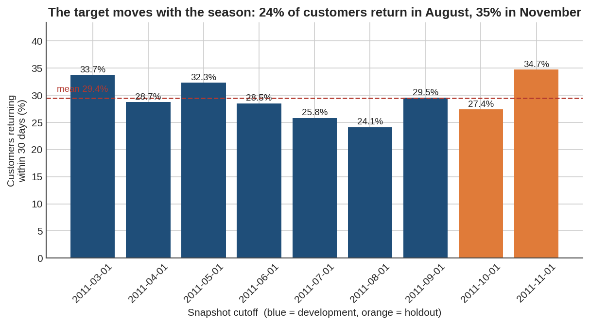
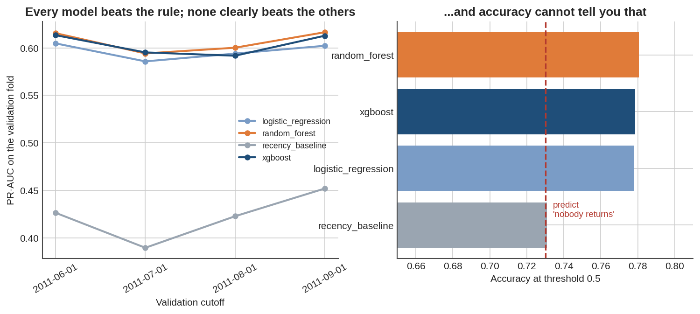
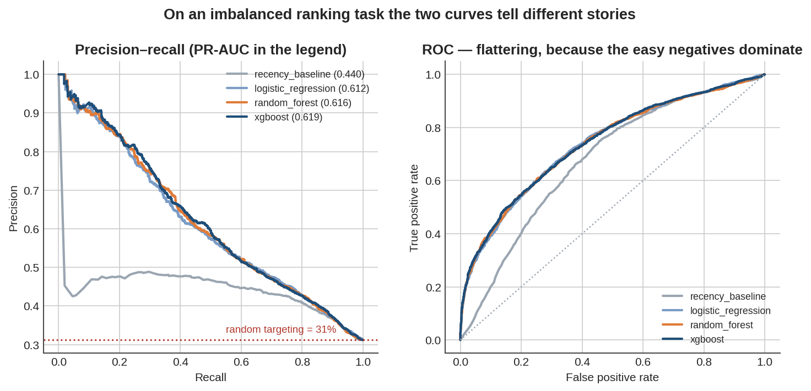
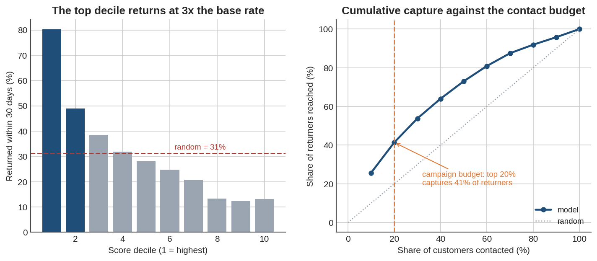
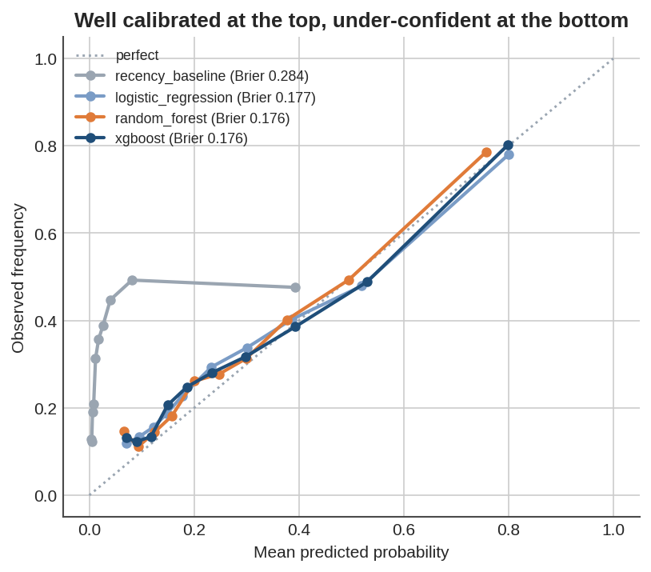
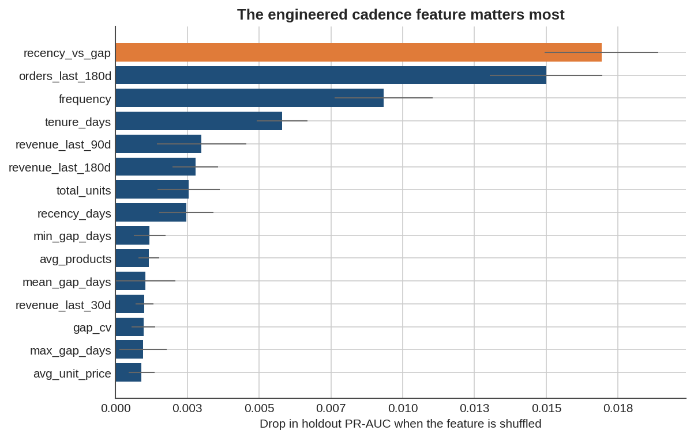
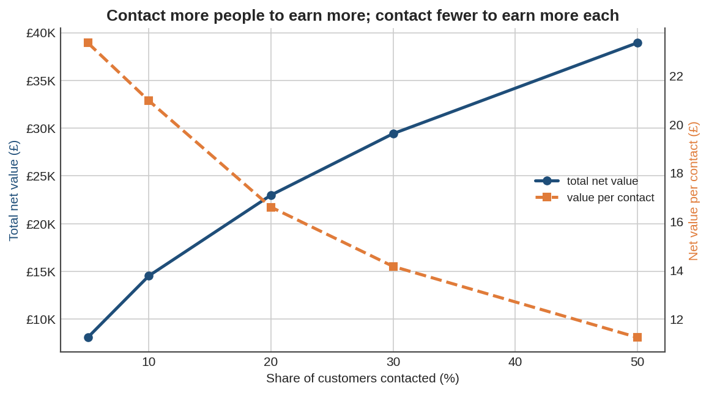

# Results

> Generated by `src/pipeline.py`. Every number is reproducible with `python -m src.pipeline`.

## Problem

For each customer with at least one prior order, predict whether they place another order within **30 days** of a monthly cutoff. Snapshots are stacked across nine cutoffs; the last two months are a holdout that model selection never saw.

## Headline (holdout: October + November 2011)

| Metric | xgboost | recency rule | difference |
|---|---:|---:|---:|
| PR-AUC | 0.619 | 0.440 | +0.180 |
| ROC-AUC | 0.741 | 0.677 | +0.064 |
| Precision@20% | 0.646 | 0.485 | +0.161 |
| Lift@20% | 2.07x | 1.56x | +0.52 |
| Brier | 0.176 | 0.284 | -0.109 |
| Accuracy | 0.749 | 0.683 | — |
| *Accuracy of 'nobody returns'* | *0.688* | | |

The last two rows are the argument against accuracy: the recency rule scores **0.683**, which is *below* the **0.688** you get by predicting that nobody ever returns — yet it ranks customers well enough to beat random targeting by 1.56x. Accuracy cannot see that, because it grades a threshold nobody uses on a decision nobody makes.

## Cross-validation (expanding window, development cutoffs only)

| model               |   pr_auc_mean |   pr_auc_std |   roc_auc_mean |   lift_mean |   lift_std |   precision_at_20 |   brier_mean |   accuracy_mean |   majority_accuracy |
|:--------------------|--------------:|-------------:|---------------:|------------:|-----------:|------------------:|-------------:|----------------:|--------------------:|
| random_forest       |        0.6066 |       0.0112 |         0.7607 |      2.2952 |     0.1167 |            0.6172 |       0.1572 |          0.7805 |              0.7302 |
| xgboost             |        0.6033 |       0.0114 |         0.759  |      2.2641 |     0.1134 |            0.6092 |       0.158  |          0.7786 |              0.7302 |
| logistic_regression |        0.5967 |       0.0086 |         0.7537 |      2.2478 |     0.1277 |            0.6042 |       0.1602 |          0.7778 |              0.7302 |
| recency_baseline    |        0.4226 |       0.0256 |         0.6924 |      1.7454 |     0.1514 |            0.4691 |       0.2456 |          0.7308 |              0.7302 |

## Holdout, per cutoff

| model               | split      |   base_rate |   pr_auc |   precision_at_20 |   lift_at_20 |
|:--------------------|:-----------|------------:|---------:|------------------:|-------------:|
| recency_baseline    | 2011-10-01 |       0.274 |    0.383 |             0.421 |        1.538 |
| recency_baseline    | 2011-11-01 |       0.347 |    0.496 |             0.546 |        1.575 |
| logistic_regression | 2011-10-01 |       0.274 |    0.561 |             0.555 |        2.028 |
| logistic_regression | 2011-11-01 |       0.347 |    0.658 |             0.696 |        2.006 |
| random_forest       | 2011-10-01 |       0.274 |    0.566 |             0.572 |        2.089 |
| random_forest       | 2011-11-01 |       0.347 |    0.661 |             0.694 |        2.002 |
| xgboost             | 2011-10-01 |       0.274 |    0.568 |             0.579 |        2.116 |
| xgboost             | 2011-11-01 |       0.347 |    0.665 |             0.705 |        2.034 |

PR-AUC is not comparable across the two months, because it scales with the base rate (27.4% in October, 34.7% in November). Lift is, which is why it is the metric quoted to the business.

## Base rate by cutoff

| cutoff     |   customers |   returned |   base_rate | split       |
|:-----------|------------:|-----------:|------------:|:------------|
| 2011-03-01 |        1271 |        428 |        33.7 | development |
| 2011-04-01 |        1701 |        489 |        28.7 | development |
| 2011-05-01 |        2132 |        689 |        32.3 | development |
| 2011-06-01 |        2436 |        694 |        28.5 | development |
| 2011-07-01 |        2716 |        702 |        25.8 | development |
| 2011-08-01 |        2963 |        715 |        24.1 | development |
| 2011-09-01 |        3154 |        929 |        29.5 | development |
| 2011-10-01 |        3314 |        907 |        27.4 | holdout     |
| 2011-11-01 |        3613 |       1253 |        34.7 | holdout     |

## Campaign capacity

|    k |   contacted |   hits |   precision | revenue   | cost   | net     |   net_per_contact |   recall |   lift |
|-----:|------------:|-------:|------------:|:----------|:-------|:--------|------------------:|---------:|-------:|
| 0.05 |         346 |    307 |       0.887 | £8,596    | £519   | £8,077  |            23.344 |    0.142 |  2.845 |
| 0.1  |         693 |    556 |       0.802 | £15,568   | £1,040 | £14,528 |            20.965 |    0.257 |  2.573 |
| 0.2  |        1385 |    895 |       0.646 | £25,060   | £2,078 | £22,982 |            16.594 |    0.414 |  2.072 |
| 0.3  |        2078 |   1162 |       0.559 | £32,536   | £3,117 | £29,419 |            14.157 |    0.538 |  1.793 |
| 0.5  |        3464 |   1576 |       0.455 | £44,128   | £5,196 | £38,932 |            11.239 |    0.73  |  1.459 |

## Calibration (holdout, quantile bins)

|   predicted |   observed |    gap |
|------------:|-----------:|-------:|
|       0.071 |      0.131 | -0.061 |
|       0.09  |      0.123 | -0.032 |
|       0.118 |      0.134 | -0.017 |
|       0.149 |      0.206 | -0.057 |
|       0.187 |      0.248 | -0.062 |
|       0.234 |      0.28  | -0.047 |
|       0.299 |      0.317 | -0.019 |
|       0.393 |      0.386 |  0.007 |
|       0.531 |      0.489 |  0.042 |
|       0.799 |      0.802 | -0.003 |

## Stability after training

| cutoff     |   months_after_training |   base_rate |   pr_auc |   lift_at_20 |   mean_predicted |
|:-----------|------------------------:|------------:|---------:|-------------:|-----------------:|
| 2011-10-01 |                       1 |       0.274 |   0.5677 |        2.116 |            0.282 |
| 2011-11-01 |                       2 |       0.347 |   0.6647 |        2.034 |            0.292 |

## Permutation importance (holdout, scored by PR-AUC)

| feature           |   pr_auc_drop |     std |
|:------------------|--------------:|--------:|
| recency_vs_gap    |       0.01693 | 0.00198 |
| orders_last_180d  |       0.015   | 0.00196 |
| frequency         |       0.00933 | 0.00171 |
| tenure_days       |       0.0058  | 0.00089 |
| revenue_last_90d  |       0.00299 | 0.00156 |
| revenue_last_180d |       0.00278 | 0.00079 |
| total_units       |       0.00254 | 0.00109 |
| recency_days      |       0.00246 | 0.00095 |
| min_gap_days      |       0.00118 | 0.00055 |
| avg_products      |       0.00115 | 0.00036 |
| mean_gap_days     |       0.00104 | 0.00104 |
| revenue_last_30d  |       0.001   | 0.00031 |
| gap_cv            |       0.00097 | 0.00041 |
| max_gap_days      |       0.00096 | 0.00082 |
| avg_unit_price    |       0.0009  | 0.00045 |

## Figures

